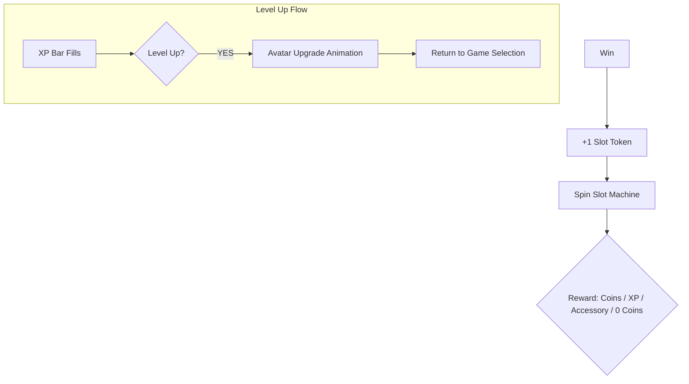
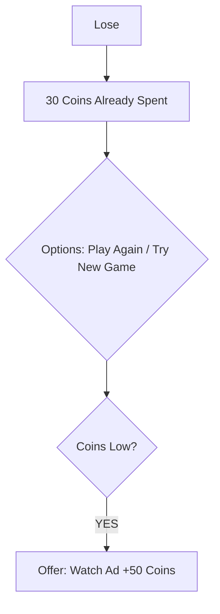
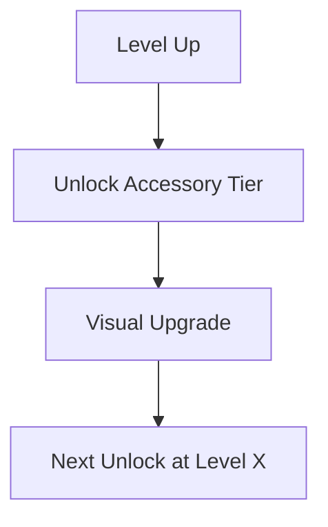
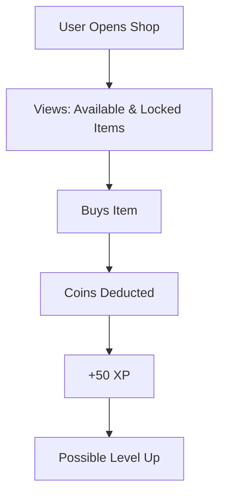
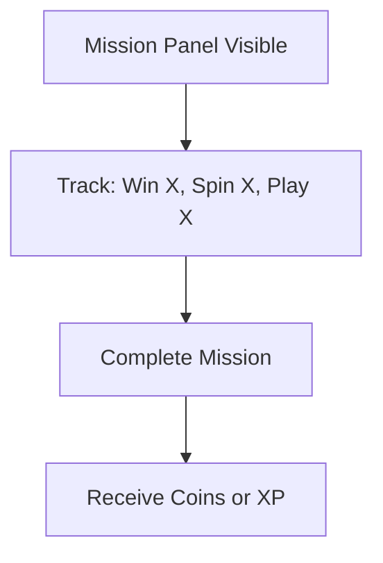
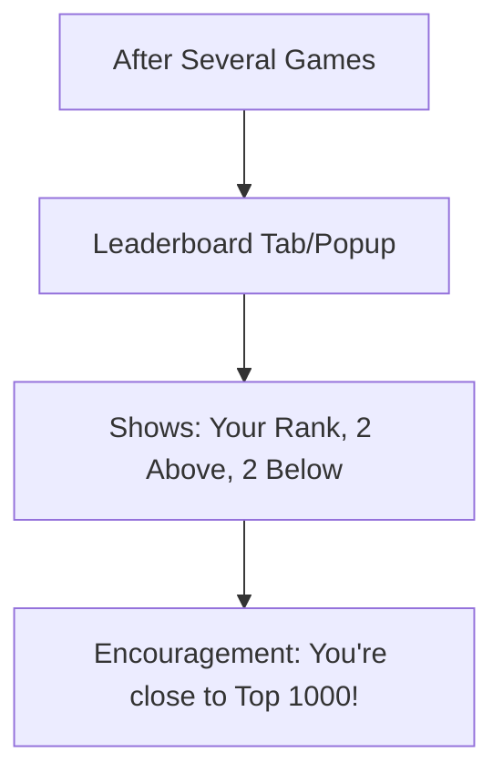
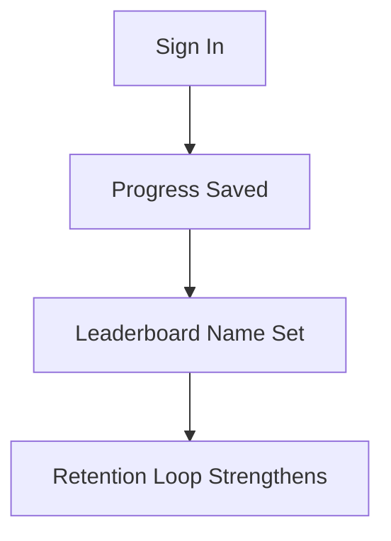
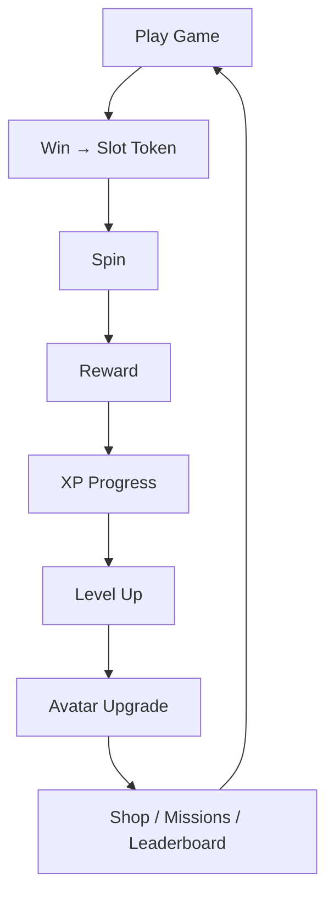

# 🎮 FULL USER FLOW – COMPLETE EXPERIENCE (V1)

This document outlines the **complete user journey** for the gamified app experience, including:  
**Gameplay → Slot Machine → Rewards → XP/Levels → Avatar → Shop → Missions → Leaderboard → Sign-in Prompts → Ads Exposure**.

---

## 🚀 1. Entry

```mermaid
flowchart TD
    A[User Lands on Page] --> B[Sees: Game Grid, Coins, XP Bar, Avatar (Level 1)]
    B --> C[Clicks "Play Game"]
```

**Ads Exposure (on entry):**
- Persistent banner visible
- Optionally, pre-roll/interstitial (per ad policy)

---

## 🔄 2. Game Loop

```mermaid
flowchart TD
    D[Plays Game (30 coins)] --> E{Outcome?}
```

---

### 🏆 A) Win Path



**Ads Exposure (win path):**
- Banner persists
- Interstitial after every X games (configurable)
- Rewarded ad available if coins are low

---

### ❌ B) Lose Path



**Ads Exposure (lose path):**
- Banner persists
- Higher chance for rewarded ad prompt when coins are low
- May show interstitial after X games (not on first loss)

---

## 🎰 3. Slot Machine Sub-Loop

```mermaid
flowchart TD
    S[Win] --> T[Spin]
    T --> U[Animation (2–3 sec suspense)]
    U --> V[Reward Outcome]
    V --> W[Coin Balance Updates]
    W --> X[XP Updates]
```

**Core Psychology Loop:**  
*Game → Token → Suspense → Reward → Replay*

---

## 🧍 4. Avatar Progression



**UX Triggers:**
- Avatar reacts when leveling up
- Store icon pulses with new available items

---

## 🛒 5. Item Shop Flow



**Ads Exposure (shop):**
- Banner persistent
- Optional rewarded ad (discount/bonus coins, not intrusive)

---

## 📆 6. Daily & Weekly Missions



**UX Principles:**
- Progress bars always displayed
- One-click claim
- Weekly rewards are bigger and prominently shown

---

## 🏅 7. Leaderboard Flow



**Ads Exposure (leaderboard):**
- Optional interstitial after closing (low frequency)

---

## 🔑 8. Sign-in Touchpoints

**First Prompt:** After the **2nd win** (post slot reward).

**Additional Prompts:**
- When winning a rare accessory
- When opening the leaderboard
- When completing weekly mission



**UX Rule:** Never block early gameplay; sign-in is optional and value-focused (e.g., to “save progress”).

---

## ♻️ 9. Master Loop (Single-Screen Summary)



---

## 📺 10. Ads Exposure Map

Ads can appear in these locations:

- **Persistent banner:** Always shown on the hub and most screens
- **Interstitial:** Every X games (frequency can be tuned)
- **Rewarded video:** When coins are low (+50 coins bonus)
- **Shop rewarded option:** Bonus/discount (optional)
- **Interstitial after leaderboard:** Low frequency, optional

**Ad density increases if:**
- user is low on coins
- user plays for longer sessions (with frequency caps)
- user cycles games rapidly

---

## 📈 11. Engagement Phases (Levels 1–10+)

- **Phase 1 (Lv 1–3):** Game & slot, very accessible, minimal barriers
- **Phase 2 (Lv 3–6):** Avatar and shop unlock, more progression
- **Phase 3 (Lv 6–10):** Missions and leaderboard bring in competition and routine
- **Phase 4 (Lv 10+):** Full retention and optimization features, deep ecosystem

---

## ✅ Experience Summary

Users feel:

- 🎲 **Play**
- 🤩 **Suspense**
- 🏅 **Reward**
- 🚀 **Growth**
- 🧠 **Optimization**
- 🏆 **Competition**
- 💰 **Monetization Moments**